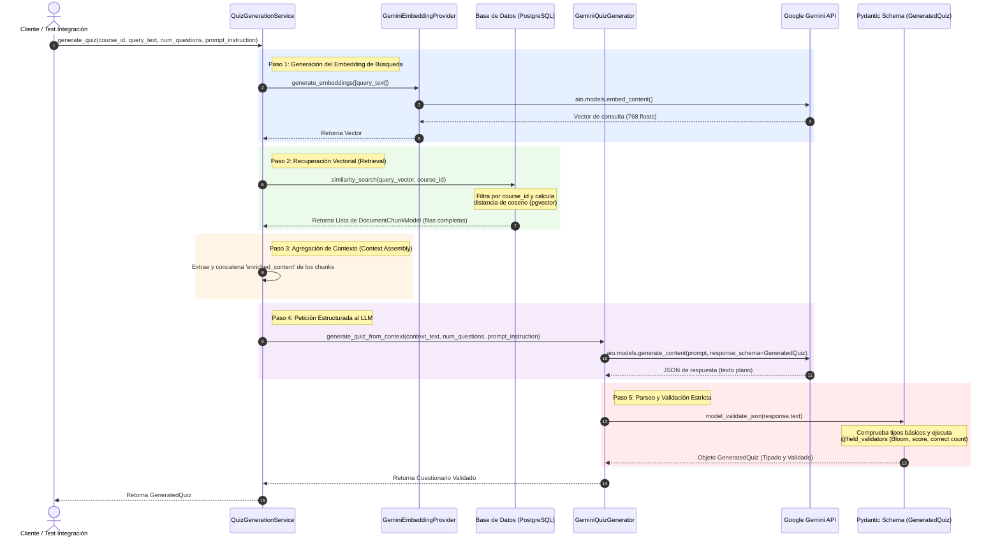

# Flujo de Ejecución: Generación de Preguntas con RAG y Pydantic

Este documento detalla el flujo de ejecución del sistema RAG (Retrieval-Augmented Generation) para la generación estructurada de cuestionarios (quizzes), incluyendo la explicación técnica de cómo se utiliza **Pydantic** para garantizar la integridad de los datos generados por Inteligencia Artificial.

---

## 1. El Rol de Pydantic en la Generación Estructurada

**Pydantic** es una biblioteca de Python diseñada para validar tipos de datos en tiempo de ejecución. En este flujo, cumple dos propósitos críticos:

### A. Inline Prompts para la IA (Descripción de Campos)
Al utilizar `google-genai` con un esquema estructurado, Pydantic se convierte en el "molde" de la respuesta del LLM. Cada campo definido en el esquema lleva una directiva `Field(description="...")`. Gemini lee directamente estas descripciones en inglés para entender qué lógica debe aplicar al poblar cada campo en el JSON final.

### B. Validación de Reglas de Negocio en Backend
Aunque Gemini está forzado a responder bajo el formato JSON del esquema, podría alucinar o violar reglas específicas. Pydantic ejecuta validadores personalizados (`@field_validator`) para asegurar que:
*   El nivel cognitivo de Bloom pertenezca a los autorizados (`remember`, `understand`, `apply`, `analyze`, `evaluate`, `create`).
*   Los puntajes asignados sean mayores a cero (`score > 0`).
*   Cada pregunta contenga **exactamente una** respuesta marcada como correcta (`is_correct=True`). Si la IA genera más de una o ninguna, la validación falla y se descarta la respuesta corrupta.

---

## 2. Diagrama de Flujo del Proceso

El siguiente diagrama ilustra la secuencia completa desde que el cliente solicita el cuestionario hasta que se retorna el objeto validado:

---

## 3. Guía de Archivos y Responsabilidades en el Código

El flujo recorre los siguientes componentes ordenados por capas:

### Capa de Aplicación (Orquestación del RAG)
*   **Archivo:** [quiz_generation_service.py](file:///c:/Users/USER/Documents/GitHub/TP-Backend/modules/quiz_generation/application/services/quiz_generation_service.py)
*   **Clase:** `QuizGenerationService`
*   **Función:** `generate_quiz`
*   **Responsabilidad:** Es el cerebro del caso de uso. Pide el vector de búsqueda, invoca la búsqueda en base de datos, consolida los textos enriquecidos de los fragmentos recuperados para armar el bloque de contexto y, finalmente, delega la generación al adaptador de IA mediante el puerto.

### Capa de Dominio (Puertos y Esquemas de Datos)
*   **Archivo:** [quiz_generator_port.py](file:///c:/Users/USER/Documents/GitHub/TP-Backend/modules/quiz_generation/domain/ports/quiz_generator_port.py)
*   **Clase:** `QuizGeneratorPort` (Protocolo)
*   **Responsabilidad:** Establece el contrato de firma de métodos que la capa de infraestructura debe cumplir para generar preguntas, manteniendo el núcleo del negocio libre de dependencias de proveedores externos (como Google GenAI).
*   **Archivo:** [generation_schemas.py](file:///c:/Users/USER/Documents/GitHub/TP-Backend/modules/quiz_generation/schemas/generation_schemas.py)
*   **Clases:** `GeneratedQuiz`, `GeneratedQuestion`, `GeneratedAnswer`
*   **Responsabilidad:** Especifica las propiedades y reglas de validación en tiempo de ejecución del cuestionario generado por IA.

### Capa de Infraestructura (Implementación de Adaptadores y Datos)
*   **Archivo:** [document_chunk_repository.py](file:///c:/Users/USER/Documents/GitHub/TP-Backend/modules/content_processing/infrastructure/repositories/document_chunk_repository.py)
*   **Función:** `similarity_search`
*   **Responsabilidad:** Ejecuta la consulta SQL asíncrona a PostgreSQL, realizando la ordenación matemática mediante `cosine_distance` sobre la columna vectorial del modelo `DocumentChunkModel` y el filtrado por el curso.
*   **Archivo:** [gemini_quiz_generator.py](file:///c:/Users/USER/Documents/GitHub/TP-Backend/modules/llm_adapter/infrastructure/providers/gemini_quiz_generator.py)
*   **Clase:** `GeminiQuizGenerator`
*   **Responsabilidad:** Implementa el puerto del dominio. Se encarga de redactar la plantilla de prompt maestro inyectando la información, llamar de manera asíncrona al cliente de Gemini con la configuración del esquema estructurado y gatillar el parseo de Pydantic.
*   **Archivo:** [gemini_embedding_provider.py](file:///c:/Users/USER/Documents/GitHub/TP-Backend/modules/llm_adapter/infrastructure/providers/gemini_embedding_provider.py)
*   **Responsabilidad:** Genera la representación matemática vectorizada (embeddings) de la consulta de texto para posibilitar la búsqueda vectorial en base de datos.
